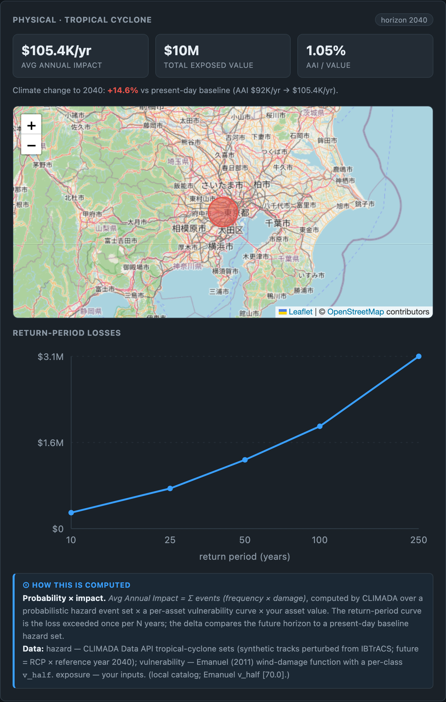

# climaterisk

**Map-first, web-based climate-risk analysis platform.** Place facilities on a map, pick climate
(RCP/SSP) and policy (NGFS) scenarios and a horizon, and assess **physical risk** (CLIMADA-backed)
and **transition / policy risk** (NGFS carbon-cost) at the **asset → portfolio → national** levels.



*Results for a single $10M Tokyo facility under RCP4.5 to 2040: expected annual impact, the
present→future climate delta, a per-asset map overlay, and the return-period loss curve — computed
by CLIMADA and rendered in the browser.*

The platform is a **framework + UI that orchestrates open-source risk engines** — it does not invent
climate science. Physical risk is computed by **CLIMADA** (run as a separate conda worker process);
transition risk uses bundled **NGFS** scenarios + **EDGAR** emission factors.

## Architecture (three processes)

```
Frontend (Vite+React+TS, react-leaflet)  ──HTTP/JSON──▶  Orchestration API (FastAPI, uv; owns the model)
                                                              │  writes a job + spawns the worker
                                                              ▼
                                                  CLIMADA worker (project-local conda env)
```

The orchestration backend imports **no** geospatial / CLIMADA code (GPL-3.0 boundary); it invokes the
worker as a separate process over a JSON file contract (`src/climaterisk/engines/base.py`). The
worker lives in a **project-local conda env** (`./.climada-env`) and never imports the backend
package. See `docs/ARCHITECTURE.md` and the algorithm/method notes in `docs/`.

## Setup

```bash
# 1. Backend (uv) + frontend (npm) deps
uv sync --all-extras
npm --prefix frontend/climaterisk install

# 2. CLIMADA worker — a project-local conda env (never a global/named env).
#    Needs conda/mamba (the GDAL/PROJ/rasterio stack is not pip-installable).
conda env create -f worker/climaterisk_worker/env_climada.yml --prefix ./.climada-env
./.climada-env/bin/python -c "import climada; print('climada ok')"
```

The backend finds the worker interpreter via `CLIMATERISK_WORKER_ENV_DIR` (default `.climada-env`);
all paths and ports live in `.env` / `config.py` (copy `.env.example` → `.env` to override).

## Run the app

```bash
./run.command          # backend (uvicorn) + frontend (Vite); checks the worker env, opens the app
```

Backend defaults to `http://127.0.0.1:8099`, frontend to `http://localhost:5174`.

## How hazard data is managed

CLIMADA needs `Hazard` / `Exposures` objects, not raw downloads — so the platform has an **import
layer** that converts each source into a CLIMADA-ready hazard and files it in a **local catalog**.

- **Local catalog** — `data/hazard_db/` with a `catalog.json` manifest keyed by
  `(peril, climate_scenario, region, year)`. Physical runners resolve hazards from here **first** and
  fall back to the live CLIMADA Data API. Add data with `scripts/build_hazard.py` or the UI's
  *Data → Fetch & ingest* — both write the HDF5 **and** register it, so the matching runner picks it
  up automatically (no manual wiring).
- **Importers** (`worker/climaterisk_worker/ingest.py`) — one refiner per source. Wired today:
  CLIMADA Data API (tropical cyclone, river flood, wildfire, earthquake) and WRI Aqueduct (river
  flood). New formats map onto the standardized-grid on-ramp (`hazard_convert.py`).
- **CLIMADA's own cache** — `~/climada/data/` (managed by CLIMADA). The only manual drop-in is the
  GPW population raster for LitPop (login-gated). See `assets/libraries/data_sources.json`.

## Develop & test

```bash
uv run ruff check . && uv run ruff format --check . && uv run mypy src/ && uv run pytest

# Engine regression (needs CLIMADA — runs in the worker env):
./.climada-env/bin/python -m pytest tests/test_physical_regression.py
```

The backend suite runs CLIMADA-free (the engine regression is auto-skipped); it is pinned against a
captured CLIMADA baseline and run in the worker env.

## Status

Asset-level **physical risk** (CLIMADA — tropical cyclone, river flood, wildfire, earthquake,
European windstorm; cost-benefit + Monte-Carlo uncertainty + LitPop exposure) and **transition risk**
(NGFS Phase-5 carbon-cost passthrough) are working end-to-end. Next: portfolio- and national-level
aggregation and the TCFD/ISSB report. See the build plan for the full roadmap.
